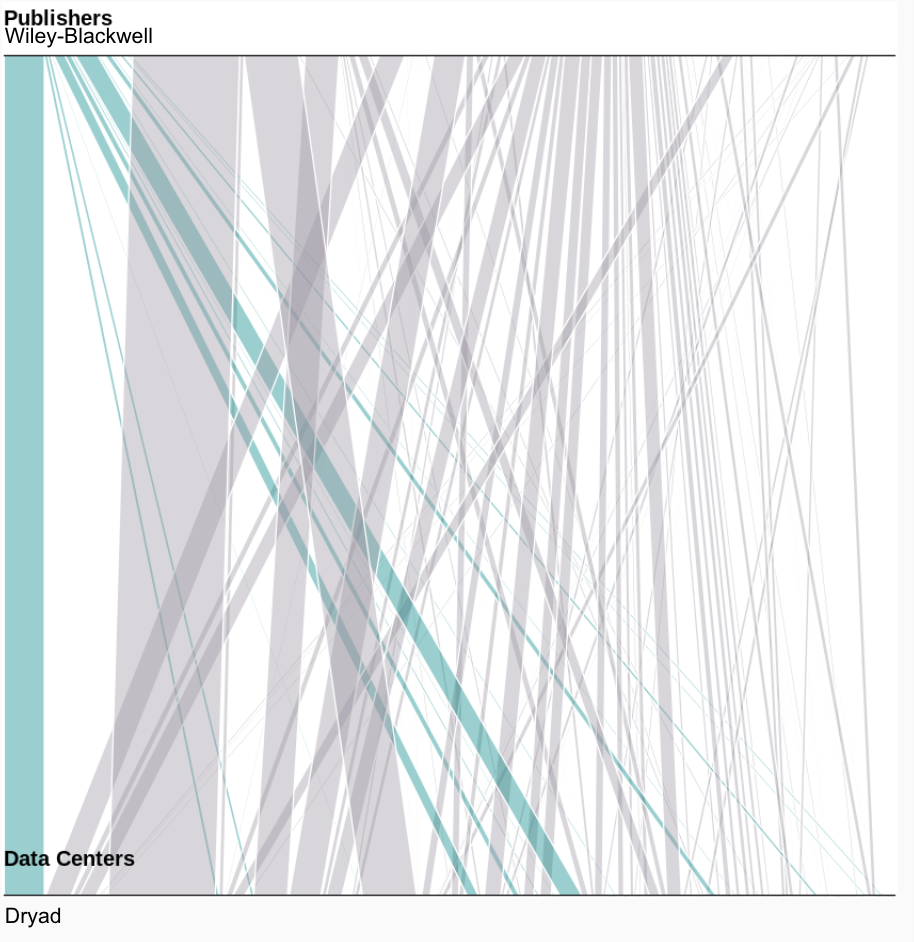

For the past several years data citation has been an important topic in the research community. This blog post examines two questions related to this topic: 1) the growth of data citation over the last several years, and 2) the limitations of using the Crossref and DataCite [Event Data](https://www.crossref.org/services/event-data/) service as a source of data citation analyses. 

In this work, we performed an exploratory analysis of data citation dataset collected via Crossref’s and DataCite's Event Data services. 

We analyzed data that used the preferred method for data citation according to the [Joint Declaration of Data Citation Principles](https://www.force11.org/datacitationprinciples) (JDDCP). Additionally, we examined records downloaded from the Crossref’s Event Data and DataCite service and developed a series of recommendations regarding the use of this source for data citation analyses. Overall, the analysis shows that data citation is growing at a slow pace. Furthermore, we found different data citation practices between publishers and data centers. We identify limitations in terms of identification of the types of relationship between datasets and publications. We anticipate that this will help identify early patterns of data citation. We also expect that this work would lay the groundwork for future analysis of data citation using the Crossref and DataCite Event Data services.

Background 

What are data citations in this context? \
There are many ways in which a researcher can cite data. Researchers can ... At the moment the prevailing formal recommendation is to cite data is the JDCCP.  That is in scholarly literature, whenever and wherever a claim relies upon data, the corresponding data should be cited \[@https://doi.org/10.25490/a97f-egyk]. The data citation principles suggest that the best way to cite data is to ... In this blogpost we analyze citation that follow the DCIP. Those citations have 

It is import to clarify that the nature of citations can vary. In some cases article authors cite their own data as way of including supplementary materials. In other cases authors cite data from other contributors as a way to reuse data produced by other researchers. 

What is Event Data?
The EventData service was collaboratively developed by Crossref and Datacite. The service collects events that are associated with scholarly resources on the web. The Crossref EventData service collects event related to article publication in the EventData hub and makes it accessible using the EventData Query API. These services are provided by Crossref.

Research questions

The exploratory analysis is trying to answer three specific questions. 

1. How many data citations are there and has data citation grown?
2. How have publishers use of data citations changed over time? 
3. Who is citing who? 

## Results

### Data citation Growth

In total we found XXX article publication links (????? is this article to data publication links ?). We found an imbalance in data citation practices used by article authors. As shown in Figure 1, we observed that article data linking information is, in most cases, provided by data producers rather than article authors. There are more than 850,000 links from data to articles compared to 22,000 links from articles to data. 

 

It is unclear why article authors are following these practices. One potential issue is that this information might not be requested by publishers. Another possibility is publishers are not included in the references list for the EventData service capturing.  It could be that Authors do not provide this information even when requested. Answering this questions would require to analyze the publishers requirements for publishing, their metadata ingestion workflows and the attitudes of their authors.  

In terms of how the data citation has changed over time we found a slight increase in data citations provided by article authors. Between March 2017 and March 2018 the increase in data citations provided by articles authors has seen a small increase. However, this increase varies by publisher. The following   slopechart illustrates data citation registration by publishers and compares the current state (2018) to 2017. We are filtering by the top contributors to this dataset only. Clearly data citation is growing at a very slow rate. The positive slope of this growth is still very narrow for most publishers  -- with the exceptions being Springer Nature and F1000. 

The media increment is with a range of . The outliers in data are characterised for a higher media increase. There are only three. These are Springer Nature, Wayle and F1000 Research.  

These also happen to be the be the publishers with the largest number of resource published that at least cite something.

### Connections Patterns

We also found interesting patterns when looking at the entities the data citations connect. These entities being publishers and data centers. We look at three top contributors of the dataset and we found three different patterns. 

For Springer Nature we observed a very spreaded  pattern. In other words the citations connect Springer nature with many and different data centers. This means that authors publishing in springer Nature cite sources in various different repositories. In the Figure 2, we highlight Dryad as one of the data centers is most citing by Springer Nature metadata. This could be related to the wide range of topic of journal by Springer Nature. 

However, this spreaded pattern is not the only one. We found that citations from F1000 Research usually always link the same data centers. That either the F1000 itself or Figshare. There are number of reasons for that. F1000 encourages to publish data together with publication and this is done in the F1000 data section. So F1000 is both a publisher and a data center. The strong likeage with Figshare come from the fact the Figshare functioned as F1000 data store in the early begining of the journal https://figshare.com/articles/F1000_and_figshare_Case_Study/1559059.

Methodology 

This analysis is restricted to data citation occurring when both articles and datasets have a DOI as persistent identifier.

We collected all data citation events from the Crossref EventData service til March 2018. We restricted the data analysis to those events that point to DataCite resources and those with the resourceType dataset. In order to collect the events we used the EventData Query API. A example of the query used is shown below:

>

We restricted the analysis to data citations that have been stored in the references of article publications with a Crossref DOIs. We do not include data citations that have been made explecity in other places. 

Metadata information of the links receiver was obtained from the DataCite API with a query like:

>

Two datasets were used in this analysis. The first dataset is about ciations provided from data centers to articles. This dataset is rather large and only a descriptive analysis of it is provided. The second dataset consisted represent data citations provided from article autors. 

The first dataset consisted of 850 data citation records. The schema of the dataset is as follows. The full dataset can be found in.

The second dataset consisted of 22k data citation records. The schema of the dataset is as follows. For this analysis this dataset was further restricted to citation to data type only. The full dataset can be found in.

All the records was processed using R and the code can be found in . 

How citations have changed over time for data centers.

Conclusions

There is still many things to investigate

We still need to analyse the large dataset of link coming from data centers.

Limitations 

There are certain limitations to the conclusion that we can drawn from this work.

The many ways to cite data

Of course this is just one of the many ways in which authors can cite data. There are many other ways.

Like Boosting your own credit score by giving yourself a loan.

Another concern is the type of relations between articles in publications. Many of the data citation relationship are obscure in the sense that we do not know whether the citated work is a supplementary material or secondary dataset. This could very well mark the difference between transparency and credit. Citing supplementary materials is important for transparency but it has no place in credit attribution. this begs the question: should all citations been counted for credit?. If self-citations should be counted, how does that impact data metrics? In a moment in time in which projects like Make Data Count is trying to provide accurated metrics for data these are a very important questions to answer.
